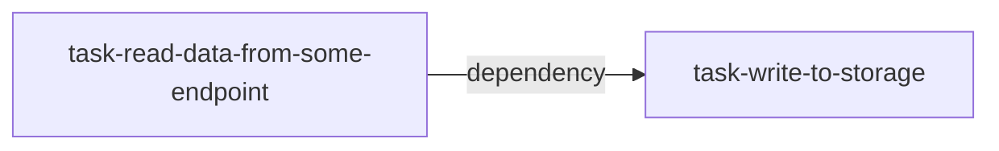

[](https://airflow.apache.org/)

This content I have created for my quick reference. I have tried to put all concepts/jargon lucidly to make our understanding of the Airflow clear and to the point.
However, before you jump and dig into it, there are two prerequisites.

- 🔴 Python
- 🔴 [Extract-Transform-Load aka ETL](https://en.wikipedia.org/wiki/Extract,_transform,_load)
 
And the reason for those prerequisites is apparent - Either we build a report or machine learning project, ETL is a must for both, and since Airflow is written in Python, we cannot avoid it. 

These notes would be enhanced in future for other features/topics. For the existing content, if you feel something is inaccurate or misleading 
then please feel free to contribute or highlight.

## Contents
- [Introduction](#Introduction)
- [Airflow Architecture](#airflow-architecture)
- [Installing Airflow](#installing-airflow)
- [Fundamentals of Airflow](#fundamentals-of-airflow)
     - [Define your Task and DAG](#define-your-task-and-dag)
     - [Airflow Module Structure](#airflow-module-structure)
     - [How to create a bit complex tasks flow?](#how-to-create-a-bit-complex-tasks-flow)
     - [Effective Task Design](#effective-task-design)
     - [Runtime Variables](#runtime-variables)
     - [Templating fields and scripts](#templating-fields-and-scripts)
     - [Workloads](#workloads)
        - [Operators](#operators)
        - [Scheduler](#scheduler)
        - [Executors](#executors)
        - [hooks](#hooks)
        - [sensors](#sensors)
- [Best Practices](#best-practices)
- [Where to go from here?](#where-to-go-from-here)
- [Reference](#reference)
     
---
## Introduction
[Airflow](https://airflow.apache.org/) is a batch-oriented framework for creating data pipelines.

It uses [DAG](https://en.wikipedia.org/wiki/Directed_acyclic_graph) to create data processing networks or pipelines.

- DAG stands for -> Direct Acyclic Graph. It flows in one direction. You can't come back to the same point, i.e. acyclic.

- In many data processing environments, a series of computations are run on the data to prepare it for one or more ultimate destinations. This type of data processing flow is often referred to as a data pipeline.
A DAG or data processing flow can have multiple paths, also called branching.

The simplest DAG could be like this.



where 
- `read-data-from-some-endpoint` & `write-to-storage`  - represent a task (unit of work)
- Arrow `-->` represents processing direction and dependencies to check on what basis the next action will be triggered.

### **Ok, so why should we use Airflow?**
- If you like *`Everything As Code`* and **everything** means everything, including your configurations 
. This helps to create any complex level pipeline to solve the problem.
- If you like open source because almost everything you can get as an inbuilt operator or executors.
- `Backfilling` features. It enables you to reprocess historical data.

### **And, why shouldn't you use Airflow?**
- If you want to build a streaming data pipeline. 

---
## Airflow Architecture

So, we have at least an idea that Airflow is created to build the data pipelines. Below we can see the different components of Airflow and their internal connections.


We can see the above components when we install Airflow, and implicitly Airflow installs them to facilitate the execution of pipelines. 
These components are 

- `DAG directory`, to keep all dag in place to be read by scheduler and executor.
- `Scheduler` parses DAGS, checks their schedule interval and starts scheduling DAGs tasks for execution by passing them to airflow workers.
- `Workers`, responsible for doing actual work. It picks up tasks and executes them.
- `Web server` presents a handy user interface to inspect, trigger, and debug the behaviour of DAGs and tasks.
- `Metadata Database`, used by the scheduler, executor, and webserver to store state so that all of them can communicate and take decisions.

For now, this is enough architecture. Let's move to the next part.

---
## Installing Airflow

Airflow provides many options for installations. You can read all the options in the [official airflow documentation](https://airflow.apache.org/docs/apache-airflow/stable/installation/index.html), and then decide which option suits your need. However, to keep it simple and experimental, I will go ahead with the Docker way of installation.

Installing Airflow with Docker is simple and intuitive which helps us to understand the typical features and working of Airflow. Below are the pre-requisites for running Airflow in Docker.
- Docker Community Edition is installed in your machine. Check this link for [Windows](https://docs.docker.com/desktop/windows/) and [Mac](https://docs.docker.com/desktop/mac/). I followed this [blog](https://adamtheautomator.com/docker-for-mac/) for docker installation on Mac
- [Docker Compose](https://docs.docker.com/compose/install/) installation.

*Caveats* - You need at least **4GB of memory** for the Docker engine.


### Installation Steps
1.  Create a file name as airflow_runner.sh. Copy the below commands in the script. 

```
docker run --rm "debian:buster-slim" bash -c 'numfmt --to iec $(echo $(($(getconf _PHYS_PAGES) * $(getconf PAGE_SIZE))))'

curl -LfO 'https://airflow.apache.org/docs/apache-airflow/2.2.4/docker-compose.yaml'

mkdir -p ./dags ./logs ./plugins

echo -e "AIRFLOW_UID=$(id -u)" > .env
```
2. Provide execute access to file. `chmod +x airflow_runner.sh`
3. Run `source airflow_runner.sh`
4. Once the above steps are completed successfully, run `docker-compose up airflow-init` to initialise the database.

After initialisation is complete, you should see a message like the below.
```
airflow-init_1       | Upgrades done
airflow-init_1       | Admin user airflow created
airflow-init_1       | 2.3.0
start_airflow-init_1 exited with code 0
```

Now, we are ready to go for the next step.

---

## Starting Docker Airflow project

👉 `docker-compose up --build`

The above command starts a docker environment and runs below services as well
- `Webserver`
- `Scheduler`
- `Postgres database for metastore.`

After a few seconds, when everything is up, the webserver is available at http://localhost:8080. The default account has the login `airflow` and the password `airflow`.

From the terminal, you can also run `docker ps ` to check the processes which are up and running.

## Cleaning up

To stop and delete containers, delete volumes with database data and download images, run:

👉 `docker-compose down --volumes --rmi all`

---

## Fundamentals of Airflow 

We have installed Airflow and know at a high level what it stands for, 
but we have yet to discover how to build our pipeline. 

We will roughly touch on a few more concepts and create a full-fledged project using these concepts.

So, let's refresh our memory one more time. Airflow works on **`DAG`** principle, and DAG is an acyclic graph. 
We saw this example `read-data-from-some-endpoint --> write-to-storage` 

So, create an airflow DAG; we will write it like this

- Step 1

Create a DAG. It accepts a unique name, when to start it, and what could be the interval of running. There are many more parameters that it agrees to, but let's stick with these three.

```python
dag = DAG(                                                     
   dag_id="my_first_dag",                          
   start_date=airflow.utils.dates.days_ago(2),                
   schedule_interval=None,                                     
)
```
- Step 2
 
 And now, we need to create our two functions (I'm creating dummy functions) and will attach them to the Operator.
```python

def read_data_from_some_endpoint():
    pass

def write_to_storage():
    pass
 
```

- Step 3

Let's create our operators. We have python functions which need to be attached to some Operators. The last argument is that it accepts a DAG. Here we need to tell the operator which dag it will consider.

```python

download_data = PythonOperator(. # This is our Airflow Operator.
    task_id="download_data", # unique name; it could be any name 
    python_callable=read_data_from_some_endpoint, # python function/callable
    dag = dag # Here we will attach our operator with the dag which we created at 1st step.
) 

persist_to_storage = PythonOperator(
    task_id = "persist_to_storage",  
    python_callable = write_to_storage,
    dag = dag
) 
 ```

- Step 4

Now, Lets create the execution order of our operators

```python

download_data >> persist_to_storage  # >> is bit shift operator in python which is overwritten in Airflow to indicate direction of task flow.

 ```

 That's it. We have successfully created our first DAG.

### **Define your Task and DAG**

Airflow provides three ways to define your DAG

1. Classical 
2. with context manager
2. Decorators 

It doesn't matter which way you define your workflow but sticking to only one helps to debug and review the codebase. Mixing different definitions can perplex the code (though it is a personal choice)

```python
# Classical 

import pendulum
from airflow import DAG
from airflow.operators.dummy import DummyOperator

dag = DAG("classical_dag", start_date=pendulum.datetime(2022, 5, 15, tz="UTC"),
             schedule_interval="@daily", catchup=False)

op = DummyOperator(task_id="a-dummy-task", dag=dag)

```
```python
# with context manager 

with DAG(
    "context_manager_dag", start_date=pendulum.datetime(2022, 5, 15, tz="UTC"),
    schedule_interval="@daily", catchup=False
) as dag:
    op = DummyOperator(task_id="a-dummy-task")

```

```python
# Decorators 

@dag(start_date=pendulum.datetime(2022, 5, 15, tz="UTC"),
     schedule_interval="@daily", catchup=False)
def generate_decorator_dag():
    op = DummyOperator(task_id="a-dummy-task")

dag = generate_decorator_dag()

```

### **How to create a bit complex tasks flow?**

Let's take this example.


We see two color codes have been used in the above image.

light red  - shows branch flow (two or more flows) i.e. **branch_1, branch_2**

light green - normal task for different purpose. i.e. **false_1, false_2, true_2 etc.**

Now, without worrying about code, let's create the task flow to represent the above structure.

1- Lower workflow from **branch_1**

 `branch_1 >> true_1 >> join_1`

2- Upper workflow from **branch_1**

- upper flow has two sections. The first part goes till `branch_2`
    
`branch_1 >> false_1 >> branch_2`
- and then at branch_2, two parallel execution happens and goes till false_3
 
 `branch_2 >> false_2 >> join_2 >> false_3`

`branch_2 >> true_2 >> join_2 >> false_3`

Since false_2 and true_2 is happening in parallel, so we can merge them (put them in a list) in this way 

`branch_2 >>` **[true_2, false_2]** `>> join_2 >> false_3`

and finally, we can merge the above steps like this 

`branch_1 >> false_1 >> branch_2 >> [true_2, false_2] >> join_2 >> false_3 >> join_1`

**So we have got these two from step 1 and step 2**

`branch_1 >> true_1 >> join_1`
    

`branch_1 >> false_1 >> branch_2 >> [true_2, false_2] >> join_2 >> false_3 >> join_1`
 
and that's represent the execution of task or a DAG.

### **How bit shift operator (>> or <<) defines task dependency?**
The __ rshift __ and __ lshift __ methods of the BaseOperator class implements the Python bit shift logical operator in the context of setting a task or a DAG downstream of another.
See the implementation [here](https://github.com/apache/airflow/blob/5355909b5f4ef0366e38f21141db5c95baf443ad/airflow/models.py#L2569).

So, **`bit shift`** been used as syntactic sugar for  `set_upstream` (<<) and `set_downstream` (>>) tasks.

For example 
`task1 >> task2` is same as `task2 << task1` is same as `task1.set_downstream(task2)` is same as  `task1.set_upstream(task2)`

This operator plays important roles to build relationships among the tasks.

### **Effective Task Design**

The created task should follow

### 1- Atomicity 

Means `either all occur, or nothing happens.` So each task should do only one activity and, if not the case, split the functionality into individual tasks.

### 2- Idempotency


An Airflow task is said to be idempotent if `calling the same 
task multiple times with the same inputs has 
no additional effect`. This means that rerunning a task without changing 
the inputs should not change the overall output.

**for data load**: It can be made idempotent by checking for existing results or ensuring that the task overwrites previous results.

**for database load**: `upsert` can be used to overwrite or update previous work done on the tables.


### 3-  Back Filling the previous task

The DAG class can be initiated with property `catchup`

if `catchup=False` ->  Airflow starts processing from the `current` interval.

If `catchup=True` -> This is the default property. Airflow starts processing from the `past` interval.

### **Runtime Variables**

All operators load `context` a pre-loaded variable to supply the most used variables during the DAG run. Python examples can be shown here 

```python
from urllib import request
 
import airflow
from airflow import DAG
from airflow.operators.python import PythonOperator
 
dag = DAG(
    dag_id="showconext",
    start_date=airflow.utils.dates.days_ago(1),
    schedule_interval="@hourly",
)
 
def _show_context(**context):
    """
    context here contains these preloaded items 
    to pass in dag during runtime.

    Airflow’s context dictionary can be found in the
    get_template_context method, in Airflow’s models.py.
    
    {
    'dag': task.dag,
    'ds': ds,
    'ds_nodash': ds_nodash,
    'ts': ts,
    'ts_nodash': ts_nodash,
    'yesterday_ds': yesterday_ds,
    'yesterday_ds_nodash': yesterday_ds_nodash,
    'tomorrow_ds': tomorrow_ds,
    'tomorrow_ds_nodash': tomorrow_ds_nodash,
    'END_DATE': ds,
    'end_date': ds,
    'dag_run': dag_run,
    'run_id': run_id,
    'execution_date': self.execution_date,
    'prev_execution_date': prev_execution_date,
    'next_execution_date': next_execution_date,
    'latest_date': ds,
    'macros': macros,
    'params': params,
    'tables': tables,
    'task': task,
    'task_instance': self,
    'ti': self,
    'task_instance_key_str': ti_key_str,
    'conf': configuration,
    'test_mode': self.test_mode,
    }
    """
   start = context["execution_date"]        
   end = context["next_execution_date"]
   print(f"Start: {start}, end: {end}")
 
 
show_context = PythonOperator(
   task_id="show_context", 
   python_callable=_show_context, 
   dag=dag
)
```
The above variables are pre-loaded under `context` and can be used anywhere in the operator. *Dynamic reference* happens in the `Jinja templating` way.

e.g. `{{ds}}, {{next_ds}}, {{dag_run}}`

## **Templating fields and scripts**

Two attributes in the BaseOperator define what can we put in for templating.

`template_fields`: Holds the list of variables which are templateable

`template_ext`: Contains a list of file extensions that can be read and templated at runtime

See this example for those two fields' declaration

```python
class BashOperator(BaseOperator):
    template_fields = ('bash_command', 'env') # defines which fields are templateable
    template_ext = ('.sh', '.bash')  # defines which file extensions are templateable

    def __init__(
        self,
        *,
        bash_command,
        env: None,
        output_encoding: 'utf-8',
        **kwargs,
    ):
        super().__init__(**kwargs)
        self.bash_command = bash_command  # templateable (can also give path to .sh or .bash script)
        self.env = env  # templateable
        self.output_encoding = output_encoding  # not templateable
```

**Example of DAG which uses Airflow context for templating**

Let's take an example to showcase the power of templating

```python
from datetime import datetime

BashOperator(
    task_id="print_now",
    bash_command="echo It is currently {{ macros.datetime.now() }}", 
)
```
👉 **`Note`**  

If you see here, we used **macro** to call datetime.now(). If we don't use the macro, it will raise `jinja2.exceptions.UndefinedError: 'datetime' is undefined` exception.

Check here for the [macro list](https://airflow.apache.org/docs/apache-airflow/1.10.3/macros.html).

But now you might be thinking about where we got `PythonOperator`, `DAG` etc. We will see Airflow's critical `modules ` to understand it.

👉 This topic is covered in detail in [this blog](https://www.astronomer.io/guides/templating/).

-----

## Airflow Module Structure

Airflow has a standard module structure. It has all its [important packages](https://airflow.apache.org/docs/apache-airflow/2.0.0/_modules/index.html) under airflow. Few of the essential module structures are here

- `airflow` - For DAG and other base API.
- `airflow.executors` : For all inbuilt executors.
- `airflow.operators` : For all inbuilt operators.
- `airflow.models` : For DAG, log error, pool, xcom (cross-communication) etc.
- `airflow.sensors` : Different sensors (in simple words, it is either time interval or file watcher to meet some criteria for task executions)
- `airflow.hooks` : Provides different modules to connect external API services or databases.


So, by looking at the above module, we can quickly determine that to get `PythonOperator` or any other Operator, we need to import 
them from `airflow.operators`. Similarly, an `executor` can be imported from `airflow.executors` and so on.

Apart from that, many different packages providers, including vendors and third-party enhance the capability of Airflow. All providers follow `apache-airflow-providers` nomenclatures for the package build.
Providers can contain operators, hooks, sensors, and transfer operators to communicate with many external systems, but they can also extend Airflow core with new capabilities.

This is the list of providers - [providers list](https://airflow.apache.org/docs/#providers-packages-docs-apache-airflow-providers-index-html)

-----
# Workloads

## **`Operators`**

Operators help run your function or any executable program.


### `Types of Operators`

There are many operators which help us to map our code. Few of them are
- `PythonOperator` - To wrap a python callables/functions inside it.
- `BashOperator` - To call your bash script or command. Within BashOperator we can also call any executable program. 
- `DummyOperator` - to show a dummy task
- `DockerOperator` - To write and execute docker images.
- `EmailOperator` - To send an email (using SMTP configuration)

*and there many more operators do exits.* See the full [operators list](https://airflow.apache.org/docs/apache-airflow/stable/_api/airflow/operators/index.html) in the official documentation.

## **`Scheduler`**

The scheduler is the crucial component of Airflow, as most of the magic happens here. It determines when and how your pipelines are executed. At a high level, the scheduler runs through the following steps.

1. Once users have written their workflows as DAGs, the scheduler reads the files containing these DAGs to extract the corresponding tasks, dependencies, and schedule intervals of each DAG.

2. For each DAG, the scheduler then checks whether the scheduled interval for the DAG has passed since the last time, it was read. If so, the tasks in the DAG are scheduled for execution.

3. For each scheduled task, the scheduler then checks whether the task's dependencies (= upstream tasks) have been completed. If so, the task is added to the execution queue.

4. The scheduler waits several moments before starting a new loop by jumping back to step 1.

👉 To start a scheduler, just run the `airflow scheduler` command. 

In Airflow, while defining the DAG, we provide a few options to let the scheduler know when jobs are required to be triggered.

`start_date` -> when to start the DAG.

`end_date` -> whne to stop the DAG

`schedule_interval` -> Time interval for the subsequent run. hourly, daily, minutes etc

`depends_on_past` -> Boolean to decide from when DAG will execute.

`retry_delay` -> time duration for next retry. It accepts `datetime` object. e.g. for 2 mins we will write timedelta(minutes=2)

Airflow scheduler works on the principle of **`Cron based job`** execution. Below is the cron presentation.

```
┌─────── minute (0 - 59)
│ ┌────── hour (0 - 23)
│ │ ┌───── day of the month (1 - 31)
│ │ │ ┌───── month (1 - 12)
│ │ │ │ ┌──── day of the week (0 - 6) (Sunday to Saturday;
│ │ │ │ │      7 is also Sunday on some systems)
* * * * *

```
Sometimes if you haven't worked before on Unix based cron job scheduler, then it is tough to know how to write them exactly
(it's also tricky for experienced developers as well).

Check this website to generate cron expression - https://www.freeformatter.com/cron-expression-generator-quartz.html


## **`Executors`**

It helps to run the task instance (task instances are functions which we have wrapped under operator)


### `Types of Executors`

There are two types of executors

**`Local Executors`**

- [Debug Executor](https://airflow.apache.org/docs/apache-airflow/stable/executor/debug.html)- The DebugExecutor is a debug tool and can be used from IDE. It is a single process executor that queues tasks and executes them.
- [Sequential Executor](https://airflow.apache.org/docs/apache-airflow/stable/executor/sequential.html) - Default executor and runs within scheduler. Apart from this, it executes one task instance at a time, which eventually makes it not a good candidate for production.
- [Local Executor](https://airflow.apache.org/docs/apache-airflow/stable/executor/local.html) - Run within scheduler and execute multiple tasks instance at a time. Again not a good candidate for production as it doesn't scale.

**`Remote Executors`**

- [Celery Executor](https://airflow.apache.org/docs/apache-airflow/stable/executor/celery.html) - Run tasks on dedicated machines(workers). It uses distributed task queue to distribute loads to different workers to parallelise work. It horizontally scales, making it fault-tolerant and a good candidate for production.
- [Kubernetes Executor](https://airflow.apache.org/docs/apache-airflow/stable/executor/kubernetes.html) - Run tasks in dedicated POD(worker), and Kubernetes APIs get used to managing the POD. It scales efficiently and is a perfect candidate for production.
    - [LocalKubernetes Executor](https://airflow.apache.org/docs/apache-airflow/stable/executor/local_kubernetes.html) - Local kubernetes executor.
- [CeleryKubernetes Executor](https://airflow.apache.org/docs/apache-airflow/stable/executor/celery_kubernetes.html) - It allows users to run a CeleryExecutor and a KubernetesExecutor simultaneously. An executor is chosen to run a task based on the task's queue. Choice of this executor is only needed in [a few cases](https://airflow.apache.org/docs/apache-airflow/stable/executor/celery_kubernetes.html).
- [Dask Executor](https://airflow.apache.org/docs/apache-airflow/stable/executor/dask.html) -Dask clusters can be run on a single machine or remote networks.

## **`Hooks`**

A high-level interface to establish a connection with databases or other external services.

[List of different available hooks](https://airflow.apache.org/docs/apache-airflow/stable/_api/airflow/hooks/index.html?highlight=hooks#module-airflow.hooks)

## **`Sensors`**

A particular type of operator whose purpose is to wait for an event to start the execution.
For instance, 
    
- `ExternalTaskSensor` waits on another task (in a different DAG) to complete execution.
- `S3KeySensor` S3 Key sensors are used to wait for a specific file or directory to be available on an S3 bucket.
- `NamedHivePartitionSensor` - Waits for a set of partitions to appear in Hive. 


## *What if something I'm interested in is not present in any of the modules?*

You didn't find the right operator, executors, sensors or hooks? No worries, you can write your custom stuff.
Airflow provides Base classes which we can inherit to write our custom classes.

```python
from airflow.models import BaseOperator
from airflow.sensors.base import BaseSensorOperator
from airflow.hooks.base_hook import BaseHook
from airflow.utils.decorators import apply_defaults

class MyCustomOperator(BaseOperator):
    
    @apply_defaults # for default parameters from DAG
    def __init__(**kwargs):
        super(MyCustomOperator).__init__(**kwargs)
        pass
    def execute(self, conext): # we will cover more about context in next part.
        #your logic
        pass


class MyCustomSensor(BaseSensorOperator):
    
    @apply_defaults # for default parameters from DAG
    def __init__(**kwargs):
        super(MyCustomSensor).__init__(**kwargs)
        pass
    def poke(self, context): 
        #your logic
        pass

class MyCustomHook(BaseHook):
    
    @apply_defaults # for default parameters from DAG
    def __init__(**kwargs):
        super(MyCustomHook).__init__(**kwargs)
        pass
    def get_connection(self):
        #your logic
        pass

```

# Best Practices

 - Write a clean DAG and stick with either of the one ways to create your DAG (with a context manager 
    or without context manager).
- Stick to a better naming convention while writing your task name. Be explicit and logical.
- Keep computation code (SQL, script, python code etc.) and DAG definition separate. Every time DAG loads, it recomputes, hence more time it took to load.
- Don't hardcode either constant value or any sensitive connection information in the code. Manage it in the config file or at the central level in a secure way. 
- Create the tag and use it for a quick look to group the tasks in monitoring.
- Always search for existing inbuilt airflow operators, hooks or sensors before creating your custom stuff.
- XCOM is not for heavy data transfer.
- Data Quality and Testing often get overlooked. So make sure you use a standard for your codebase.
- Follow load strategies - incremental, scd types in your code to avoid unnecessary data load.
- If possible, create a framework for DAG generations. A meta wrapper. Check out this [repo](https://github.com/ajbosco/dag-factory).
- Specify configuration details once - The place where SQL templates are is configured as an Airflow Variable and looked up as a global parameter when the DAG is instantiated.
- Pool your resources: All task instances in the DAG use a pooled connection to the DWH by specifying the pool parameter. 
- Manage login details in one place - Connection settings are maintained in the Admin menu.
- Sense when to start a task - The processing of dimensions and facts has external task sensors, which wait until all processing of external DAGs has finished up to the required day.

# Where to go from here?

An essential part of learning anything is to create a project. When we build something, we understand the working principle and its terminologies. However, we have touched almost everything we need to work on the Airflow project, but there are still many concepts we might need when we start building the actual project. 
For example, dynamic dag and task creation (dag factory), deployment, monitoring etc. (this is the #todo work)

So, let's create a project and put our learning in action by doing it 💪 

Check out this GitHub repo for the project. [Airflow - Chapel Hill Survey Data Analysis](https://github.com/saurabh2mishra/airflow-chesdata-analysis)

# Reference

The airflow community is very active, and many contributors across the globe are enriching and creating several packages and utilities to make developers' life easy. It is always good to follow the community and people on Twitter and GitHub to be in touch with new releases. 
Most of the details in these notes are taken from the below links. Check it out for more information.

- [Data Pipelines with Apache Airflow ](https://www.manning.com/books/data-pipelines-with-apache-airflow)(Highly recommended)
- [Source code](https://github.com/apache/airflow/) (Apache Airflow github)
- [Documentation](https://airflow.apache.org/) (official website)
- [Confluence page](https://cwiki.apache.org/confluence/display/AIRFLOW/Airflow+Home)
- [](https://twitter.com/ApacheAirflow)
- [Slack workspace](https://apache-airflow-slack.herokuapp.com/)
